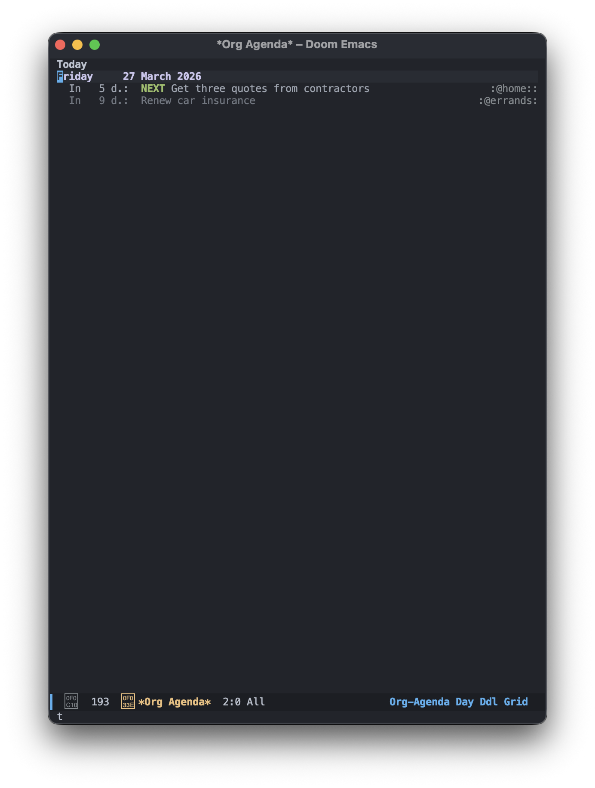
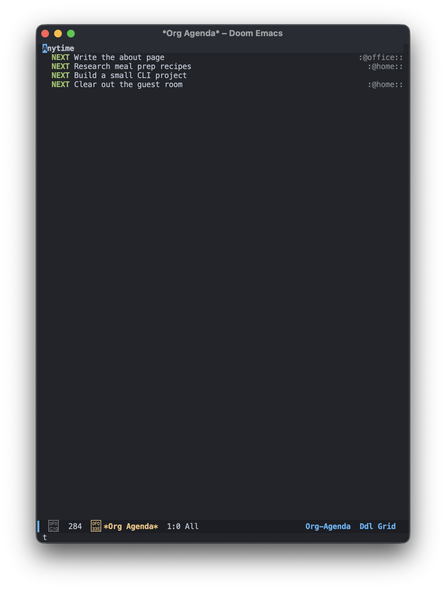
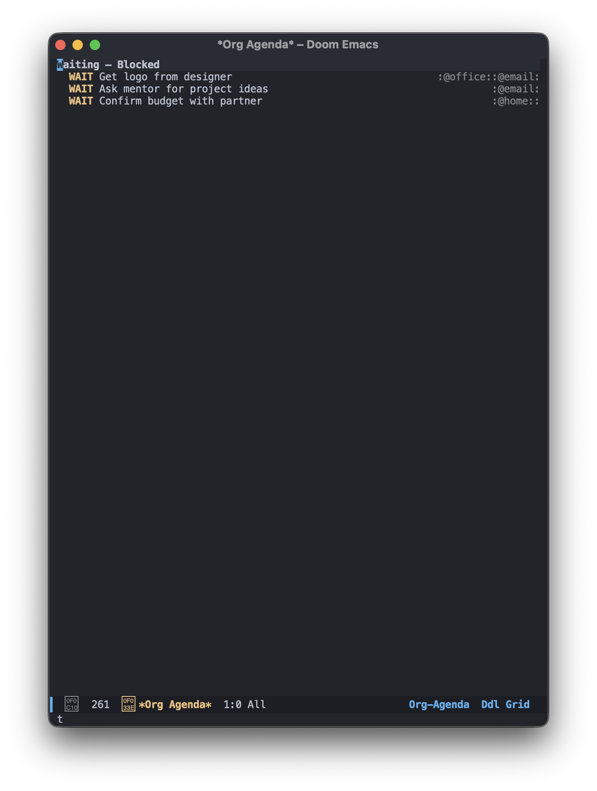
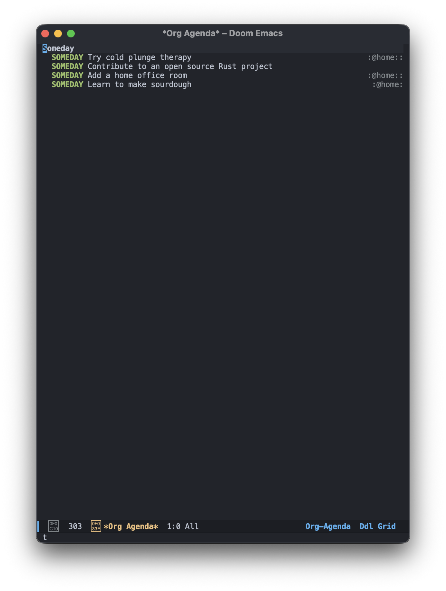
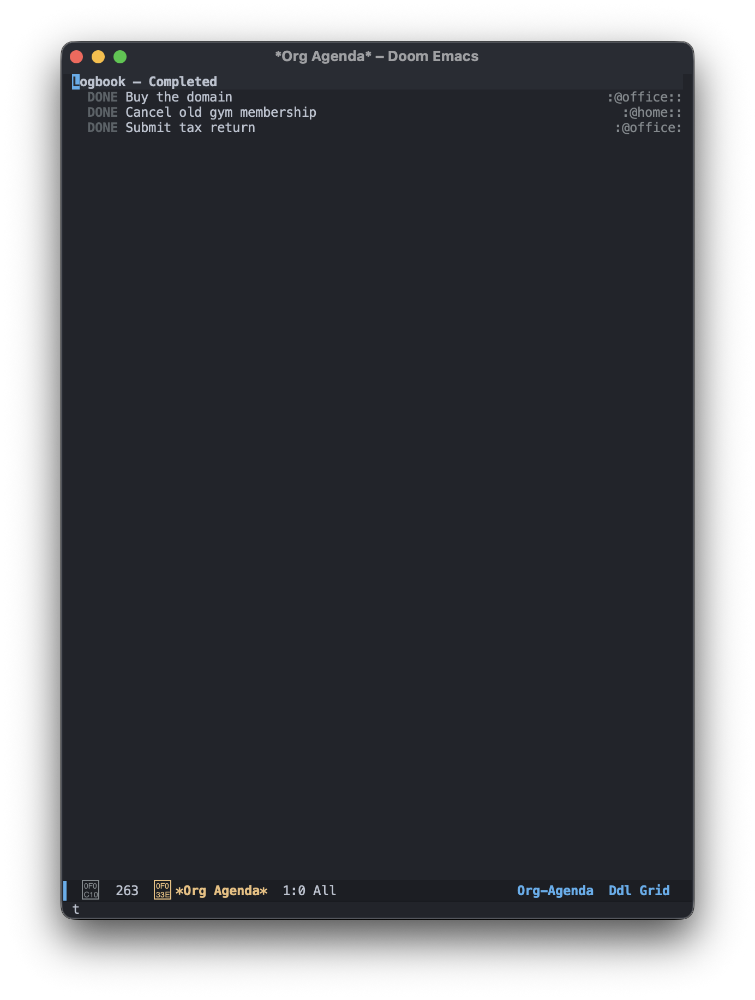

# org-gtd

> **Keywords:** org-mode gtd, emacs gtd, getting things done emacs, org-mode productivity, doom emacs gtd, emacs task manager

A GTD setup for Emacs using org-mode, inspired by the workflow and feel of Things 3. Works with **Doom Emacs** and **vanilla Emacs** (GUI + terminal).

---

## Features

- **Live dashboard** — counts for every view in a 30/70 split; click a row to open it
- **Intuitive keybindings** — `⌘K` complete, `⌘N` add, `⇧⌘M` move, and more
- **Agenda views** — Inbox / Today / Upcoming / Anytime / Waiting / Someday / Logbook
- **Dynamic context views** — auto-detects all `@tags`, no code changes when you add new ones
- **Completed tasks auto-sink** — DONE/CANCELLED tasks move to the bottom automatically
- **Auto-save** — saves on idle and on leaving insert mode; dashboard refreshes on every save
- **Direct Inbox editing** — narrows to Inbox in place, no capture buffer
- **Flat structure** — a heading with subtasks is a project, no special marking needed

---

## Screenshots

| Navigation Pane | Today |
|----------------|-------|
|  |  |

| Anytime | Upcoming |
|---------|----------|
|  |  |

| Waiting | Someday |
|---------|---------|
|  |  |

| Logbook | Context view |
|---------|-------------|
|  |  |

| Edit view | |
|-----------|--|
|  | |

---

## File Structure

| File | Purpose | Load when |
|------|---------|-----------|
| `org-gtd.el` | Core: agenda views, functions, auto-sink. No keybindings. | Always (load first) |
| `bindings-cmd.el` | `⌘` key bindings for GUI Emacs (macOS) | GUI / Doom |
| `bindings-ccg.el` | `C-c g` prefix bindings for terminal Emacs | Terminal |
| `bindings-f5.el` | `F5` prefix bindings for terminal Emacs | Terminal (alternative) |
| `bindings-prefix.el` | Shared helper used by `bindings-ccg.el` and `bindings-f5.el` | Auto-loaded |
| `doom-extras.el` | `SPC` leader bindings — Doom Emacs only | Doom only |

---

## Installation

### 1. Clone the repository

```bash
git clone https://github.com/<you>/org-gtd ~/code/org-gtd
```

### 2. Create your `gtd.org`

```org
#+TITLE: GTD
#+TODO: NEXT WAIT SOMEDAY | DONE CANCELLED
#+TAGS: @home(h) @office(f) @standup(s) @ask(a)

* Inbox

* My First Project
** NEXT First task :@office:
** NEXT Second task :@ask:

* Standalone Task :@home:
```

### 3. Load from your Emacs config

Set `my/gtd-file` before loading anything. If omitted, Emacs will prompt on first load.

**Doom Emacs** (`~/.config/doom/config.el`):
```elisp
(setq my/gtd-file "~/path/to/your/gtd.org")

(load "~/code/org-gtd/org-gtd.el")       ;; always load first
(load "~/code/org-gtd/bindings-cmd.el")  ;; ⌘ keys (GUI/macOS)
(load "~/code/org-gtd/bindings-ccg.el")  ;; C-c g prefix
(load "~/code/org-gtd/bindings-f5.el")   ;; F5 prefix
(load "~/code/org-gtd/doom-extras.el")   ;; SPC leader (Doom only)
```

**Vanilla Emacs — GUI** (`~/.emacs` or `~/.emacs.d/init.el`):
```elisp
(setq my/gtd-file "~/path/to/your/gtd.org")

(load "~/code/org-gtd/org-gtd.el")
(load "~/code/org-gtd/bindings-cmd.el")
(load "~/code/org-gtd/bindings-ccg.el")
```

**Vanilla Emacs — terminal**:
```elisp
(setq my/gtd-file "~/path/to/your/gtd.org")

(load "~/code/org-gtd/org-gtd.el")
(load "~/code/org-gtd/bindings-ccg.el")
(load "~/code/org-gtd/bindings-f5.el")
```

### 4. Restart Emacs

Doom users: run `doom sync` before restarting.

---

## Dashboard

Opening `gtd.org` (or pressing `SPC 0` / `⌘0`) shows a live count dashboard in the left pane. Click or press `RET` on any row to open that view on the right.

| Key | Action |
|-----|--------|
| `RET` / click | Open view in right pane |
| `g` or Refresh row | Re-render counts |
| `q` | Close dashboard pane |

Counts update automatically whenever you change a task state, reschedule, or save the file.

---

## How It Works

**Projects** = any heading that has subtasks. No state on the heading itself.
**Tasks** = subtask headings with a state (`NEXT`, `WAIT`, `SOMEDAY`).
**Inbox** = raw unprocessed items. No state needed.

### Task States

```
NEXT → WAIT → SOMEDAY → DONE → CANCELLED
```

| State | Meaning |
|-------|---------|
| `NEXT` | Ready to work on |
| `WAIT` | Blocked / waiting on someone |
| `SOMEDAY` | Maybe later |
| `DONE` | Completed — auto-sinks to bottom |
| `CANCELLED` | Dropped — auto-sinks to bottom |

### Context Tags

Tags starting with `@` are contexts. Add them to `#+TAGS:` in your `gtd.org`:
```
@home    @office    @standup    @ask
```
The context picker auto-detects them — no code changes needed when you add new ones.

---

## Daily Workflow

### Morning — what to work on

1. **Today** (`SPC 1` / `C-c g 1`) — scheduled + overdue
2. **Context view** (`SPC 7` / `C-c g 7`) → pick `@office` or `@home` → all NEXT tasks for that context

### During the day — adding tasks

**Know the project?** Open `gtd.org`, navigate to the project, press `⌘ N` / `C-c g n`.

**Quick thought?** Press `SPC i` / `C-c g i` → narrows to Inbox → type task → `⌘ [` to exit.

### Finishing a task

`⌘ K` / `C-c g k` → marks DONE, auto-sinks to bottom of project.

Blocked? `S-Right` to cycle to `WAIT`.

---

## Keybinding Reference

All actions are available across all binding systems simultaneously.

### Views

| Action | ⌘ (GUI) | C-c g / F5 | SPC (Doom) |
|--------|---------|------------|------------|
| Open Inbox | `⌘ i` | `… i` | `SPC i` |
| Dashboard | `⌘ 0` | `… 0` | `SPC 0` |
| Today | `⌘ 1` | `… 1` | `SPC 1` |
| Upcoming (7 days) | `⌘ 2` | `… 2` | `SPC 2` |
| Anytime (NEXT, no date) | `⌘ 3` | `… 3` | `SPC 3` |
| Waiting (blocked) | `⌘ 4` | `… 4` | `SPC 4` |
| Someday | `⌘ 5` | `… 5` | `SPC 5` |
| Logbook | `⌘ 6` | `… 6` | `SPC 6` |
| Context → NEXT tasks | `⌘ 7` | `… 7` | `SPC 7` |
| Context → all tasks | `⌘ 8` | `… 8` | `SPC 8` |

### Create

| ⌘ (GUI) | C-c g / F5 | SPC (Doom) | Action |
|---------|------------|------------|--------|
| `⌘ N` | `… n` | `SPC n` | New to-do |
| `⇧ ⌘ N` | `… N` | `SPC N` | New heading |
| `⇧ ⌘ C` | `… c` | — | New checklist item |
| `⌥ ⌘ N` | — | — | New project (top-level) |

### Edit

| ⌘ (GUI) | C-c g / F5 | SPC (Doom) | Action |
|---------|------------|------------|--------|
| `⌘ K` | `… k` | `SPC k` | Complete → auto-sinks |
| `⌥ ⌘ K` | `… K` | `SPC K` | Cancel → auto-sinks |
| `⌘ D` | `… d` | — | Duplicate subtree |
| `⇧ ⌘ Y` | `… y` | `SPC y` | Archive subtree |

### Move

| ⌘ (GUI) | C-c g / F5 | SPC (Doom) | Action |
|---------|------------|------------|--------|
| `⇧ ⌘ M` | `… m` | `SPC m` | Refile to project |
| `⌘ ↑` | `… p` | — | Move item up |
| `⌘ ↓` | `… P` | — | Move item down |
| `⌥ ⌘ ↑` | — | — | Move to top |
| `⌥ ⌘ ↓` | — | — | Move to bottom |

### Dates

| ⌘ (GUI) | C-c g / F5 | SPC (Doom) | Action |
|---------|------------|------------|--------|
| `⌘ S` | `… s` | `SPC s` | Schedule (date picker) |
| `⌘ T` | `… t` | `SPC t` | Start Today |
| `⌘ R` | `… r` | `SPC r` | Anytime (remove schedule) |
| `⌘ O` | `… o` | `SPC o` | Someday |
| `⇧ ⌘ D` | `… D` | `SPC D` | Deadline |
| `^ ]` | — | — | Schedule +1 day |
| `^ [` | — | — | Schedule −1 day |
| `^ }` | — | — | Schedule +1 week |
| `^ {` | — | — | Schedule −1 week |
| `^ .` | — | — | Deadline +1 day |
| `^ ,` | — | — | Deadline −1 day |

### Navigate

| ⌘ (GUI) | C-c g / F5 | Action |
|---------|------------|--------|
| `⌘ →` | `… ]` | Zoom into subtree |
| `⌘ [` | `… [` | Zoom out *(⌘← grabbed by macOS)* |
| `⌘ F` | `… f` | Search headings |

### Tags & Filter

| ⌘ (GUI) | C-c g / F5 | SPC (Doom) | Action |
|---------|------------|------------|--------|
| `⇧ ⌘ T` | `… T` | `SPC T` | Tag picker |
| `^ ⌘ F` | `… /` | `SPC /` | Filter by tag (flat list) |

**Tag match syntax:**

| Example | Meaning |
|---------|---------|
| `@office+NEXT` | tag AND state |
| `@office\|@home` | tag OR tag |
| `@office-DONE` | tag but NOT done |

### Task State Shortcuts

| Key | Action |
|-----|--------|
| `S-Right` / `S-Left` | Cycle state forward / back |
| `⌘ K` / `… k` | → DONE |
| `⌥ ⌘ K` / `… K` | → CANCELLED |
| `⌘ O` / `… o` | → SOMEDAY |

---

## Contributing

### Areas that could use help

- Support for multiple org files
- Linux/Windows keybinding alternatives
- Energy level filtering (`energy_high`, `energy_medium`, `energy_low`)
- org-roam integration for linked notes

### How to contribute

1. Fork and create a branch: `git checkout -b feature/your-idea`
2. Keep `org-gtd.el` and `bindings-*.el` free of Doom macros — they must work in vanilla Emacs
3. `doom-extras.el` is Doom-only — Doom macros are fine there
4. Update this README if you add or change keybindings
5. Open a PR with a clear description

---

## License

MIT
