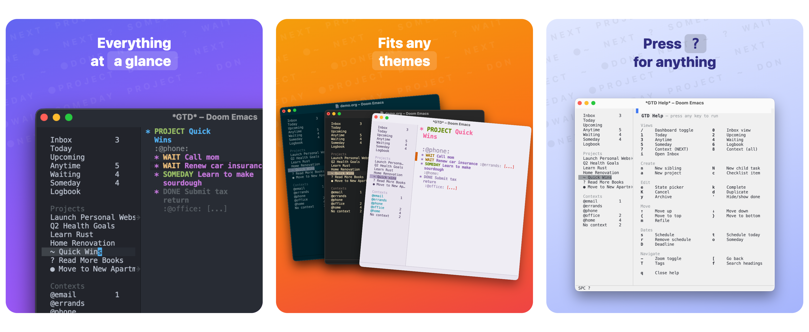

# org-gtd

GTD in Emacs. No packages, no dependencies — just Elisp.

[](LICENSE)
[](https://www.gnu.org/software/emacs/)
[](https://github.com/doomemacs/doomemacs)

A GTD setup for org-mode, inspired by the workflow and feel of Things 3. Works with **Doom Emacs** and **vanilla Emacs** (GUI + terminal).

> **Not the `org-gtd` MELPA package.** This is an independent configuration loaded directly from your config.

### Quick Start

```elisp
(setq my/gtd-file "~/path/to/your/gtd.org")
(load "~/dotfiles/org-gtd/org-gtd.el")
(load "~/dotfiles/org-gtd/bindings-cmd.el")
```

---

**Contents:** [Features](#features) · [Installation](#installation) · [Daily Workflow](#daily-workflow) · [How It Works](#how-it-works) · [Keybindings](#keybinding-reference) · [Demo](#try-it-with-demoorg) · [Scope](#scope)

---

## Features

**Views**
- **Live dashboard** — counts for every view in a 30/70 split; click a row to open it
- **Agenda views** — Inbox / Today / Upcoming / Anytime / Waiting / Someday / Logbook
- **Dynamic context views** — auto-detects all `@tags`, no code changes when you add new ones
- **Logbook decorations** — DONE entries show a checkmark prefix; CANCELLED entries show strikethrough
- **Empty-state messages** — views display contextual messages when no tasks match (e.g. "Nothing due today.")

**Editing**
- **State picker** — `⌘ e` opens a one-line prompt; single keypress sets state or promotes a task to a top-level project
- **Completed tasks auto-sink** — DONE/CANCELLED tasks move to the top of the done group automatically
- **Smart completion** — completing a task with active children prompts to complete all of them together
- **Hide done** — `⌘ '` toggles DONE/CANCELLED tasks in and out of view; persists across outline cycles
- **Direct Inbox editing** — narrows to Inbox in place, no capture buffer

**Organization**
- **Clear project states** — `PROJECT` state marks active projects; indicators show active (no prefix), blocked/deferred (`~`), stale (`●`), or empty (`?`)
- **Intuitive keybindings** — `⌘ k` complete, `⌘ n` add, `⇧⌘M` refile, and more
- **Interactive help** — `SPC ?` / `⌘ ?` opens a cheatsheet; press any key to execute the action

**Automation**
- **Auto-save** — saves on idle and on leaving insert mode; dashboard refreshes on every save
- **Auto-open** — `gtd.org` opens automatically on Emacs startup (configurable via `my/gtd-open-on-startup`)

---

## Installation

<details>
<summary>Setup steps</summary>

### 1. Clone the repository

```bash
git clone https://github.com/aravindps/org-gtd ~/dotfiles/org-gtd
```

### 2. Create your `gtd.org`

```org
#+TITLE: GTD
#+TODO: PROJECT NEXT WAIT SOMEDAY | DONE CANCELLED
#+TAGS: @home(h) @office(f) @standup(s) @ask(a)

* Inbox

* My First Project
** NEXT First task :@office:
** NEXT Second task :@ask:
```

### 3. Load from your Emacs config

Set `my/gtd-file` **before** loading anything. This variable is required — loading without it will cause errors.

**Doom Emacs** (`~/.config/doom/config.el`):
```elisp
(setq my/gtd-file "~/path/to/your/gtd.org")

(load "~/dotfiles/org-gtd/org-gtd.el")        ;; always load first
(load "~/dotfiles/org-gtd/bindings-cmd.el")   ;; ⌘ keys (GUI/macOS)
(load "~/dotfiles/org-gtd/bindings-ccg.el")   ;; C-c g prefix
(load "~/dotfiles/org-gtd/bindings-f5.el")    ;; F5 prefix
(load "~/dotfiles/org-gtd/bindings-doom.el")  ;; SPC leader (Doom only)
(load "~/dotfiles/org-gtd/doom-overrides.el") ;; Doom/evil conflict fixes (load last)
```

**Vanilla Emacs — GUI** (`~/.emacs` or `~/.emacs.d/init.el`):
```elisp
(setq my/gtd-file "~/path/to/your/gtd.org")

(load "~/dotfiles/org-gtd/org-gtd.el")
(load "~/dotfiles/org-gtd/bindings-cmd.el")
(load "~/dotfiles/org-gtd/bindings-ccg.el")
```

**Vanilla Emacs — terminal**:
```elisp
(setq my/gtd-file "~/path/to/your/gtd.org")

(load "~/dotfiles/org-gtd/org-gtd.el")
(load "~/dotfiles/org-gtd/bindings-ccg.el")
(load "~/dotfiles/org-gtd/bindings-f5.el")
```

> **Mouse in terminal** — add `(xterm-mouse-mode 1)` to your config to enable mouse support. Works in iTerm2 and most modern terminals.

### 4. Configuration

| Variable | Default | Purpose |
|----------|---------|---------|
| `my/gtd-file` | `nil` | **Required.** Path to your GTD org file. |
| `my/gtd-open-on-startup` | `t` | Open `gtd.org` automatically on Emacs launch. Set to `nil` to disable. |

### 5. Restart Emacs

Doom users: run `doom sync` before restarting.

</details>

---

## Daily Workflow

### Morning — what to work on

1. **Today** (`SPC 1` / `C-c g 1`) — scheduled + overdue
2. **Context view** (`SPC 7` / `C-c g 7`) → pick `@office` or `@home` → all NEXT tasks for that context

### During the day — adding tasks

**Know the project?** Open `gtd.org`, navigate to the project, press `⌘ n` / `C-c g n`.

**Quick thought?** Press `SPC i` / `C-c g i` → narrows to Inbox → type task → `SPC -` / `C-c g -` to zoom out when done.

### Triaging Inbox

Open Inbox view (`SPC 0` / `C-c g 0`), navigate to an item, then:
- `⇧⌘M` / `C-c g M` / `SPC M` — refile to an existing project (Shift+m everywhere; plain `⌘m` is macOS minimize)
- `⌘ e` / `C-c g e` — use the state picker to set state or promote to project

### Finishing a task

`⌘ k` / `C-c g k` → marks DONE, auto-sinks into the done group within the project.

Blocked? `S-Right` to cycle to `WAIT`.

---

## How It Works

**Projects** = level-1 headings with `PROJECT` state (or no state). Has subtask children.

**Tasks** = subtask headings with a state (`NEXT`, `WAIT`, `SOMEDAY`).  

**Inbox** = raw unprocessed items under `* Inbox`. No state needed.

### Task States

```
PROJECT → NEXT → WAIT → SOMEDAY → DONE → CANCELLED
```

| State | Meaning |
|-------|---------|
| `PROJECT` | Marks a level-1 heading as a project |
| `NEXT` | Ready to work on |
| `WAIT` | Blocked / waiting on someone |
| `SOMEDAY` | Maybe later |
| `DONE` | Completed — auto-sinks into done group |
| `CANCELLED` | Dropped — auto-sinks into done group |

### Context Tags

Tags starting with `@` are contexts. Add them to `#+TAGS:` in your `gtd.org`:
```
@home    @office    @standup    @ask
```
The context picker auto-detects them — no code changes needed when you add new ones.

### Dashboard

Opening `gtd.org` (or pressing `SPC /` / `⌘/`) shows a live count dashboard in the left pane. Counts update automatically on state changes, reschedules, and saves. The Contexts section includes a "No context" row for untagged NEXT tasks.

---

## Keybinding Reference

All actions are available across all binding systems simultaneously. Press `SPC ?` / `⌘ ?` in Emacs for an interactive cheatsheet.

<details>
<summary>Full keybinding tables</summary>

### Views

| Action | ⌘ (GUI) | C-c g / F5 | SPC (Doom) |
|--------|---------|------------|------------|
| Open Inbox | `⌘ i` | `… i` | `SPC i` |
| Dashboard | `⌘ /` | `… /` | `SPC /` |
| Inbox view | `⌘ 0` | `… 0` | `SPC 0` |
| Today | `⌘ 1` | `… 1` | `SPC 1` |
| Upcoming | `⌘ 2` | `… 2` | `SPC 2` |
| Anytime (NEXT, no date) | `⌘ 3` | `… 3` | `SPC 3` |
| Waiting (blocked) | `⌘ 4` | `… 4` | `SPC 4` |
| Someday | `⌘ 5` | `… 5` | `SPC 5` |
| Logbook | `⌘ 6` | `… 6` | `SPC 6` |
| Context → NEXT tasks | `⌘ 7` | `… 7` | `SPC 7` |
| Context → all tasks | `⌘ 8` | `… 8` | `SPC 8` |

### Create

| ⌘ (GUI) | C-c g / F5 | SPC (Doom) | Action |
|---------|------------|------------|--------|
| `⌘ n` | `… n` | `SPC n` | New sibling heading (NEXT) |
| `⌘ N` | `… N` | `SPC N` | New child task (NEXT) |
| `⌘ C` | `… c` | `SPC c` | New checklist item |
| `⌥ ⌘ a` | `… a` | `SPC a` | New top-level project |

### Edit

| ⌘ (GUI) | C-c g / F5 | SPC (Doom) | Action |
|---------|------------|------------|--------|
| `⌘ e` | `… e` | `SPC e` | State picker (NEXT / WAIT / SOMEDAY / DONE / CANCEL / Promote) |
| `⌘ k` | `… k` | `SPC k` | Complete → auto-sinks |
| `⌥ ⌘ k` | `… K` | `SPC K` | Cancel → auto-sinks |
| `⌘ '` | `… '` | `SPC '` | Toggle hide DONE/CANCELLED |
| `⌘ d` | `… d` | `SPC d` | Duplicate subtree |
| `⌘ Y` | `… y` | `SPC y` | Archive subtree |

### Move

| ⌘ (GUI) | C-c g / F5 | SPC (Doom) | Action |
|---------|------------|------------|--------|
| `⇧⌘M` | `… M` | `SPC M` | Refile to project (Shift+m on every layer; Doom `SPC m` free) |
| `⌘ ↑` | `… <up>` | `SPC <up>` | Move subtree up |
| `⌘ ↓` | `… <down>` | `SPC <down>` | Move subtree down |
| `⌥ ⌘ ↑` | — | — | Move to top |
| `⌥ ⌘ ↓` | — | — | Move to bottom |

### Dates

| ⌘ (GUI) | C-c g / F5 | SPC (Doom) | Action |
|---------|------------|------------|--------|
| `⌘ s` | `… s` | `SPC s` | Schedule (date picker) |
| `⌘ t` | `… t` | `SPC t` | Start Today |
| `⌘ r` | `… r` | `SPC r` | Anytime (remove schedule) |
| `⌘ o` | `… o` | `SPC o` | Someday |
| `⌘ D` | `… D` | `SPC D` | Deadline |

### Navigate

| ⌘ (GUI) | C-c g / F5 | SPC (Doom) | Action |
|---------|------------|------------|--------|
| `⌘ →` | — | — | Narrow to subtree |
| `⌘ ←` | — | — | Widen to full file |
| — | `… -` | `SPC -` | Toggle narrow/widen |
| `⌘ [` | — | — | Go back (winner-undo) |
| `⌘ f` | `… f` | — | Search headings |
| `⌃ ⌘ o` | — | — | Switch GTD file |

### Tags

| ⌘ (GUI) | C-c g / F5 | SPC (Doom) | Action |
|---------|------------|------------|--------|
| `⌘ T` / `^ ⌘ T` | `… T` | `SPC T` | Tag picker |

**Tag match syntax:**

| Example | Meaning |
|---------|---------|
| `@office+NEXT` | tag AND state |
| `@office\|@home` | tag OR tag |
| `@office-DONE` | tag but NOT done |

> **Promote to project** — in the state picker, press `p` to cut a task and re-insert it as a top-level project immediately after the `* Inbox` heading, carrying all its children along.

</details>

---

## Try It With demo.org

<details>
<summary>Quick-start with the included demo file</summary>

A `demo.org` file is included so you can try the setup without touching your real data. It covers the full GTD structure — inbox items, projects, tasks in every state, scheduled and deadline entries, and context tags.

**With your existing config** — just point `my/gtd-file` at the demo file and reload:
```elisp
(setq my/gtd-file "~/dotfiles/org-gtd/demo.org")
```

**Without any config (vanilla Emacs)** — launch with no init file and load everything in one shot:
```sh
emacs -Q
# GUI on macOS:
/Applications/Emacs.app/Contents/MacOS/Emacs -Q
```
Then paste into `M-:` (`M-x eval-expression`):
```elisp
(progn
  (require 'org)
  (setq my/gtd-file "~/dotfiles/org-gtd/demo.org")
  (load "~/dotfiles/org-gtd/org-gtd.el")
  (load "~/dotfiles/org-gtd/bindings-cmd.el")
  (load "~/dotfiles/org-gtd/bindings-ccg.el")
  (load "~/dotfiles/org-gtd/bindings-f5.el")
  (find-file my/gtd-file))
```

The dashboard opens automatically. Switch back to your real file by updating `my/gtd-file` and reloading.

</details>

---

## Scope

Covers the **ground level of GTD** — capturing, clarifying, and doing. No weekly review automation, no calendar, no recurring tasks, no reference storage. The goal is a clean, fast task system in Emacs that gets out of your way. You bring the discipline.

---

## File Structure

<details>
<summary>Files and load order</summary>

| File | Purpose | Load when |
|------|---------|-----------|
| `org-gtd.el` | Core: agenda views, functions, auto-sink. No user keybindings. | Always (load first) |
| `bindings-cmd.el` | `⌘` key bindings for GUI Emacs (macOS) | GUI / Doom |
| `bindings-ccg.el` | `C-c g` prefix bindings for terminal Emacs | Terminal |
| `bindings-f5.el` | `F5` prefix bindings for terminal Emacs | Terminal (alternative) |
| `bindings-prefix.el` | Shared helper used by `bindings-ccg.el` and `bindings-f5.el` | Auto-loaded |
| `bindings-doom.el` | `SPC` leader bindings — Doom Emacs only | Doom only |
| `doom-overrides.el` | Doom/evil conflict fixes — Doom Emacs only | Doom only (load last) |
| `demo.org` | Sample GTD file for trying the setup | Optional |

</details>

---

## Contributing

1. Fork and create a branch: `git checkout -b feature/your-idea`
2. Keep `org-gtd.el` and `bindings-*.el` free of Doom macros — they must work in vanilla Emacs
3. `bindings-doom.el` is Doom-only — Doom macros are fine there
4. Update this README if you add or change keybindings
5. Open a PR with a clear description

---

## License

GPL-3.0 — see [LICENSE](LICENSE) for details.
